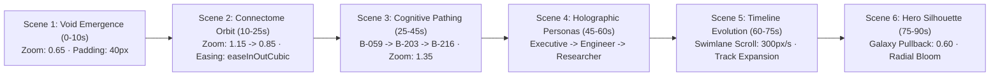
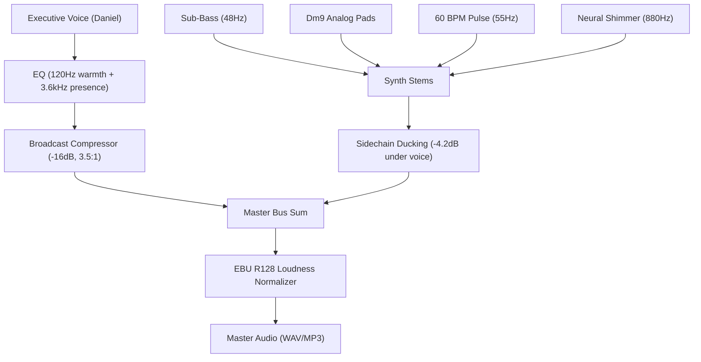

# Brain OS — Cinematic Motion & Choreography Specification

This document details the After Effects / Code-Driven Motion Architecture, Cognitive Camera parameters, and Multimodal Composite Rules used in the **Brain OS 90-Second Flagship Enterprise Launch Video**.

---

## 🎥 Camera Choreography & Cognitive Pathing

Rather than tracking mouse interactions, Brain OS implements a **Cognitive Camera** that follows the sequence of architectural thought:



### Cognitive Camera API (`apps/viz/components/CinematicDirector.tsx`)

```typescript
interface BrainDirector {
  // Scene orchestration
  setScene(sceneNum: number, config?: Partial<TelemetryState>): void;
  showTitle(title: string, subtitle: string, durationMs?: number): void;
  setSubtitle(text: string): void;
  setHud(hudType: "none" | "overview" | "hub" | "path" | "persona" | "timeline" | "hero"): void;
  
  // Camera motion
  orbitCamera(targetZoom: number, durationMs: number): void;
  focusNode(nodeId: string): void;
  highlightPath(nodeIds: string[]): void;
  resetCamera(durationMs: number): void;
  
  // View & Persona transforms
  switchPersona(personaId: "executive" | "engineer" | "researcher" | "pm" | "architect"): void;
  switchView(viewId: "map" | "cluster" | "timeline" | "journey" | "heatmap"): void;
}
```

---

## 🌌 Particle Synapse & Node Breathing Physics

### 1. Node Breathing ($f = 0.5\text{Hz}$)
Every active neuron oscillates with harmonic breathing to convey living computational state:
$$\text{scale}(t) = 1.0 + 0.03 \cdot \sin(2\pi \cdot 0.5 \cdot t)$$
$$\text{opacity}(t) = \text{base\_opacity} \cdot (0.85 + 0.15 \cdot \cos(2\pi \cdot 0.5 \cdot t))$$

### 2. Synaptic Photon Particles (60 FPS Canvas)
Traveling light pulses follow active edge vectors $\mathbf{p}(t) = \mathbf{p}_{\text{src}} + t \cdot (\mathbf{p}_{\text{dst}} - \mathbf{p}_{\text{src}})$:
- **Default Speed**: $\Delta t = 0.012$–$0.025$ per frame.
- **Active Reasoning Speed**: $\Delta t = 0.035$ per frame.
- **Glow Core**: 4.5px radius in radiant `#38bdf8` electric cyan with radial alpha falloff.

---

## 🎚️ Audio & Sound Design Architecture

### Broadcast EBU R128 Master Standards
- **Integrated Loudness**: $-14.0\text{ LUFS}$
- **True Peak**: $-1.0\text{ dBTP}$
- **Loudness Range (LRA)**: $7.0\text{ LU}$
- **Sampling Rate**: $48\text{ kHz}$ stereo (24-bit PCM / 320 kbps AAC)



---

## 📱 Deliverables & File Matrix

| Asset | Resolution / Spec | Length | File Path |
| :--- | :--- | :--- | :--- |
| **Flagship Master** | 1920×1080 (3840×2160 raster) @ 60fps | 90.2s | [`docs/media/brain_os_flagship_90s.mp4`](file:///home/getentergram/Documents/GitHub/entergram/docs/media/brain_os_flagship_90s.mp4) |
| **Teaser Cut** | 1920×1080 @ 60fps | 30.0s | [`docs/media/brain_os_teaser_30s.mp4`](file:///home/getentergram/Documents/GitHub/entergram/docs/media/brain_os_teaser_30s.mp4) |
| **Social Cut** | 1080×1920 (9:16 Vertical) @ 60fps | 15.0s | [`docs/media/brain_os_social_15s.mp4`](file:///home/getentergram/Documents/GitHub/entergram/docs/media/brain_os_social_15s.mp4) |
| **Master Audio WAV** | 48kHz / 24-bit Stereo | 90.0s | [`docs/media/audio/brain_os_master_mix.wav`](file:///home/getentergram/Documents/GitHub/entergram/docs/media/audio/brain_os_master_mix.wav) |
| **Master Audio MP3** | 320 kbps High-Bitrate Stereo | 90.0s | [`docs/media/audio/brain_os_master_mix.mp3`](file:///home/getentergram/Documents/GitHub/entergram/docs/media/audio/brain_os_master_mix.mp3) |
| **Broadcast Subtitles** | SubRip (`.srt`) & WebVTT (`.vtt`) | 90.0s | [`docs/media/subtitles/brain_os_narration.srt`](file:///home/getentergram/Documents/GitHub/entergram/docs/media/subtitles/brain_os_narration.srt) |
| **Scraped Reference Images** | 38 High-Res Storyboard Assets | — | [`docs/media/scraped_images/`](file:///home/getentergram/Documents/GitHub/entergram/docs/media/scraped_images/) |
