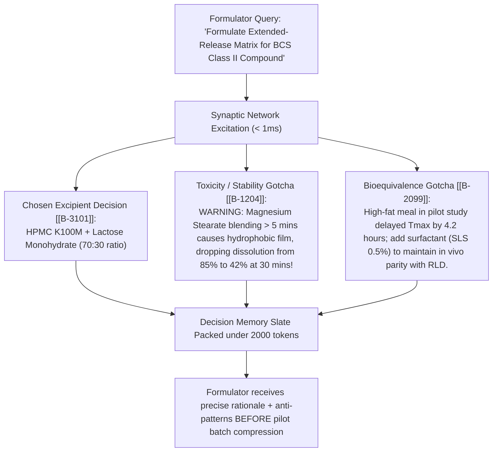

# Enterprise Pharma Decision Memory: Deep-Dive Blueprint for Dr. Reddy's Laboratories & Matrix Laboratories

---

## Executive Summary & Core Finding

The global pharmaceutical software and AI discovery landscape (spanning **Veeva Vault**, **Benchling**, **Dotmatics Luma**, **Causaly**, **Palantir Foundry**, **Schrödinger LiveDesign**, and **Recursion/Exscientia**) is split into three fragmented silos:
1. **Lab Informatics & eDMS (Veeva, Benchling, Dotmatics)**: Stores *what was recorded* (final study reports, ELN notebook pages, LIMS samples), but loses the *causal rationale* of **why** decisions were made and what alternatives were rejected.
2. **Biomedical Literature Knowledge Graphs (Causaly, BenevolentAI, Palantir Foundry)**: Maps external public paper triples (`Gene → Target → Disease`), but is completely blind to internal proprietary chemistry dead-ends and institutional trial history.
3. **In Silico Molecular Design (Schrödinger, Insilico, Recursion)**: Generates *de novo* molecules or physics simulations, but lacks memory of real-world downstream formulation stability, scale-up impurities, and clinical bioequivalence.

> [!IMPORTANT]
> **The Core Gap**: **NONE of the existing platforms possess true Decision Memory.**
> * They build **Knowledge Graphs** (static entities and triples).
> * They build **Document RAG** (semantic search over PDFs).
> * They build **Generative Chemistry** (diffusion models predicting binding).
> 
> **Decision Memory** is not about entities—it is about **the evolutionary learning loop**: capturing *why* an API synthesis route was selected over 8 alternative synthetic pathways, *why* 35 formulation excipient ratios failed bioequivalence, tracking *temporal confidence decay* as polymorphic patents shift, and enforcing *selective recall* so scientists never repeat historical multi-million-dollar mistakes.

---

# 1. Competitor Landscape: What Are They Actually Building vs. The Decision Memory Gap

```
┌─────────────────────────────────────────────────────────────────────────────────────────────┐
│                           PHARMA INFORMATICS COMPETITIVE MATRIX                             │
│                                                                                             │
│  PLATFORM TIER           REPRESENTATIVE PLAYERS       WHAT THEY BUILD       DECISION MEMORY?│
│  ─────────────────────   ──────────────────────       ───────────────       ────────────────│
│  1. Lab Informatics      Veeva Vault, Benchling,      Structured ELNs,      ❌ NO           │
│     & eDMS               Dotmatics Luma, Waters       Sample LIMS, PDFs     (Stores records)│
│                                                                                             │
│  2. Biomedical           Causaly, Palantir Foundry,   Literature graphs,    ❌ NO           │
│     Knowledge Graphs     Sanofi Plai, BenevolentAI    Entity triples        (Public facts)  │
│                                                                                             │
│  3. In Silico Molecular  Schrödinger LiveDesign,      Physics (FEP+),       ❌ NO           │
│     & Generative AI      Insilico, Recursion/Exsc.    Diffusion generation  (No scale/form) │
│                                                                                             │
│  4. ★ PHARMAGRAM         Entergram Decision Engine    Causal Provenance,    🏆 YES          │
│     (Our Architecture)                                Negative Assays,      (Evolutionary   │
│                                                       Temporal Decay, MARL   Decision Brain)│
└─────────────────────────────────────────────────────────────────────────────────────────────┘
```

### Detailed Competitor Breakdown

#### Tier 1: Lab Informatics & Enterprise Document Management
* **Veeva Vault**: The enterprise standard for regulatory filings (eCTD), clinical trials (eTMF), and quality management (QMS).
  * *What it does*: Strict document versioning, 21 CFR Part 11 electronic signatures, workflow approvals.
  * *Why it lacks Decision Memory*: Veeva stores the *finished approved PDF*, not the micro-decisions made along the way. If a formulation chemist in 2021 discovered that *poloxamer-188* caused degradation at $40^\circ\text{C}/75\%\text{RH}$, that gotcha is trapped in a 400-page unindexed validation report.
* **Benchling / Dotmatics Luma**: Modern cloud ELNs and LIMS tracking plasmids, cell lines, and liquid-handling assay runs. Dotmatics released "Luma Agent" (May 2026) as an LLM copilot to run queries.
  * *What it does*: Streamlines data entry for wet-lab scientists and provides natural-language querying over lab data models.
  * *Why it lacks Decision Memory*: They record observational logs (*"Batch B-101 had 82% yield"*), but lack causal provenance graphs linking the choice of solvent to previous toxic byproduct rejections.

#### Tier 2: Biomedical Literature Knowledge Graphs & Data Fabrics
* **Causaly**: High-precision biomedical graph with 500M+ facts extracted from PubMed and patents.
  * *What it does*: Helps biologists identify disease-target mechanisms from published literature.
  * *Why it lacks Decision Memory*: It is purely external and literature-derived. It knows zero internal institutional history about proprietary compounds, unpublished assay failures, or plant-floor tech transfer bottlenecks.
* **Palantir Foundry (Sanofi Plai)**: Enterprise data harmonization fabric linking clinical trials, supply chain, and research data.
  * *What it does*: Multi-source data unification and executive KPI dashboards.
  * *Why it lacks Decision Memory*: Foundry builds an *object ontology* (Entities: Batches, Patients, Trials). It does not model Popperian falsification, cognitive amygdala gotchas, or RL-optimized selective memory recall.

#### Tier 3: Computational Chemistry & Phenomics
* **Schrödinger (LiveDesign / FEP+)**: High-performance physics-based molecular docking and free-energy perturbation.
  * *What it does*: Predicts binding affinity ($pIC_{50}$) for *in silico* designs.
  * *Why it lacks Decision Memory*: Completely blind to downstream formulation, API impurity formation, polymorphic stability, and clinical bioequivalence.
* **Recursion Pharmaceuticals (acquired Exscientia in Nov 2024)**: High-throughput automated phenomics microscopy + generative chemistry.
  * *What it does*: Massive automated biological imaging to find phenotypic hits.
  * *Why it lacks Decision Memory*: Focuses on discovery screening throughput, not institutional memory preservation or formulation/manufacturing lifecycle reasoning.

---

# 2. The Operational Reality of Dr. Reddy's Laboratories & Matrix Laboratories (Viatris)

Large, vertically integrated pharmaceutical leaders like **Dr. Reddy’s Laboratories** and **Matrix Laboratories (Viatris)** have distinct operational models spanning **APIs (Active Pharmaceutical Ingredients)**, **Complex Generics**, **Biosimilars**, and **Proprietary Specialty/NCE R&D**.

```
┌─────────────────────────────────────────────────────────────────────────────────────────────┐
│                    THE DR. REDDY'S / MATRIX OPERATIONAL VALUE CHAIN                         │
│                                                                                             │
│  [STAGE 1: API SYNTHESIS & ROUTE SCOUTING]                                                  │
│  • Route selection: Cost of Goods (COGS), yield, non-infringing patent pathways.            │
│  • Critical Challenge: Genotoxic Impurities (ICH M7 - Nitrosamines) & solvent carryover.   │
│                                                                                             │
│  [STAGE 2: SOLID-STATE & POLYMORPHISM CONTROL]                                              │
│  • Salt selection, co-crystals, amorphous solid dispersions (ASD).                          │
│  • Critical Challenge: Polymorph conversion during wet granulation / high humidity.        │
│                                                                                             │
│  [STAGE 3: FORMULATION & BIOEQUIVALENCE (BE)]                                               │
│  • Excipient compatibility, dissolution profile matching vs. Innovator (RLD).               │
│  • Critical Challenge: In Vivo BE study failures ($500k - $2M per failed clinical study).   │
│                                                                                             │
│  [STAGE 4: TECHNOLOGY TRANSFER & PLANT SCALE-UP]                                            │
│  • Scale-up: R&D (100g) → Pilot (10kg) → Commercial Plant (1,000kg batch reactor).          │
│  • Critical Challenge: Non-linear mixing dynamics causing unpredicted impurity spikes.      │
│                                                                                             │
│  [STAGE 5: REGULATORY AUDITING & FDA 483 / OOS INVESTIGATIONS]                              │
│  • Out-of-Specification (OOS) root cause analysis and CAPA compliance.                     │
│  • Critical Challenge: Knowledge loss across shifts leading to recurring 483 citations.     │
└─────────────────────────────────────────────────────────────────────────────────────────────┘
```

---

# 3. How to Deploy the Decision Memory Brain at Dr. Reddy's & Matrix Labs

Below is the step-by-step process plan for deploying **Pharmagram Decision Memory** across the four most critical operational pillars of Dr. Reddy's and Matrix Laboratories.

---

## Pillar A: API Route Scouting & Nitrosamine/Genotoxic Impurity Management

```
┌─────────────────────────────────────────────────────────────────────────────────────────────┐
│                     DECISION MEMORY IN API SYNTHESIS & ROUTE SCOUTING                       │
│                                                                                             │
│                                  [TARGET API: Sitagliptin / Valsartan]                      │
│                                                    │                                        │
│                     ┌──────────────────────────────┴──────────────────────────────┐         │
│                     ▼                                                             ▼         │
│     ┌──────────────────────────────┐                             ┌────────────────────────┐ │
│     │ ROUTE 1: Asymmetric Cyanation│                             │ ROUTE 2: Enzymatic     │ │
│     │ (status: REJECTED)           │                             │ Transamination         │ │
│     └──────────────┬───────────────┘                             │ (status: CHOSEN B-201) │ │
│                    │                                             └───────────┬────────────┘ │
│                    │ [edge: rejected]                                        │              │
│                    ▼                                                         ▼              │
│     ┌──────────────────────────────┐                             ┌────────────────────────┐ │
│     │ TOXICITY GOTCHA B-108:       │                             │ PURITY DECISION B-205: │ │
│     │ "Secondary amine + nitrite   │                             │ "pH maintained at 7.2  │ │
│     │ solvent traces formed NDMA   │                             │ prevents enamine dimer │ │
│     │ at > 0.03 ppm limit (ICH M7)"│                             │ byproduct (yield 91%)" │ │
│     └──────────────────────────────┘                             └────────────────────────┘ │
└─────────────────────────────────────────────────────────────────────────────────────────────┘
```

### The Process Plan for Route Scouting:
1. **Ingest Historical Synthesis Notebooks**: Ingest 10+ years of Dr. Reddy's API process development reports into structured `type: compound_decision` and `type: synthesis_route` cells.
2. **Activate the Impurity Amygdala Gate**: Every time a process chemist drafts a route in the ELN/IDE, the brain stimulates all connected cells:
   * *If an intermediate involves dimethylamine in acidic conditions, the brain immediately fires `BioCell B-108` (`type: toxicity_gotcha`), alerting the chemist to NDMA nitrosamine formation risk before wet-lab synthesis begins.*
3. **Continuous COGS & Yield Optimization**: As plant yield data streams in via KPN channels, Hebbian reinforcement updates the confidence weights of the catalytic reaction steps.

---

## Pillar B: Formulation Development & Bioequivalence (BE) Failure Prevention

Bioequivalence (BE) studies cost **$500,000 to $2,000,000 per study** in human volunteers. A failed BE study delays generic market entry by **12–18 months**, costing tens of millions in first-to-file (FTF) 180-day exclusivity value.



### The Process Plan for Formulation:
1. **Capture Bioequivalence Causal Provenance**: Map every pilot and pivotal BE study outcome back to specific excipient grades, particle size distributions ($D_{90}$), and dissolution profiles ($f_1 / f_2$ similarity factors).
2. **Enforce Negative Excipient Memory**: When an excipient ratio fails stability at $40^\circ\text{C}/75\%\text{RH}$, record the exact degradation pathway in a `type: toxicity_gotcha` cell.
3. **Selective Recall in LIMS**: When a formulator logs a new formulation trial in Benchling/LIMS, the MCP server automatically recalls historical gotchas for that exact API crystal habit.

---

## Pillar C: Technology Transfer & Commercial Scale-Up (Pilot $\to$ Plant)

During scale-up from 50-liter pilot vessels to 5,000-liter commercial reactors, changes in heat transfer, impeller tip speed, and shear stress cause unpredicted crystallization shifts and impurity spikes.

### The Tech Transfer Decision Protocol:

```
┌─────────────────────────────────────────────────────────────────────────────────────────────┐
│                           TECH TRANSFER DECISION PROTOCOL                                   │
│                                                                                             │
│  R&D LAB (100g Scale)                PILOT PLANT (10kg Scale)      COMMERCIAL PLANT (1000kg)│
│  ────────────────────                ────────────────────────      ─────────────────────────│
│  • Identifies optimal crystal habit  • Discovers shear stress      • Enforces cooling-rate  │
│    (Form I polymorph).                 causes Form II conversion.    parameter limits in DCS│
│  • Stores Cell B-401 (Form I).       • Records Gotcha B-402:       • Plant DCS controller   │
│                                        "Impeller rpm > 120 causes    traps over-agitation via│
│                                        shear-induced nucleation".    RLM effector script.   │
└─────────────────────────────────────────────────────────────────────────────────────────────┘
```

1. **Cellular Scale Parameters**: Each cell encodes **Critical Material Attributes (CMAs)** and **Critical Process Parameters (CPPs)** as decision constraints (`edge: constrained_by`).
2. **Root-Cause Investigation Engine (FDA 483 / OOS)**: When an Out-of-Specification (OOS) batch occurs in manufacturing, the quality team queries:
   ```bash
   $ pharmagram trace B-402
   ```
   The brain traces the causal tree across R&D, pilot, and commercial validation batches, isolating whether the deviation was caused by a raw material supplier change, cooling-rate anomaly, or operator parameter drift.

---

## Pillar D: Complex Generics & Biosimilars Decision Lifecycle

For biosimilars (e.g., Trastuzumab, Bevacizumab, Pegfilgrastim at Dr. Reddy's/Matrix):
1. **Bioreactor Process Decisions**: Track cell line selection (CHO vs NS0), glycosylation profiles, and bioreactor feeding strategies ($C(t)$ validity tied to target quality profiles).
2. **Higher-Order Structure Provenance**: Connect circular dichroism, peptide mapping, and bioassay potency records into a unified decision lineage proving biosimilarity to the FDA/EMA.

---

# 4. The Evolutionary Feedback Loop: How the Brain Learns Over Decades

```
┌─────────────────────────────────────────────────────────────────────────────────────────────┐
│                         THE 20-YEAR PHARMA BRAIN EVOLUTION LOOP                             │
│                                                                                             │
│        [Continuous Physical Experiments: Assays, Dissolutions, BE Studies, Plant Batches]   │
│                                               │                                             │
│                                               ▼                                             │
│        [Kahn Process Network Stream Ingestion: Zero-Loss Deterministic Telemetry]           │
│                                               │                                             │
│                                               ▼                                             │
│        [Outcome Witness Resolution: Target Confirmed? BE Passed? Impurity Controlled?]      │
│                                               │                                             │
│                        ┌──────────────────────┴──────────────────────┐                      │
│                        ▼                                             ▼                      │
│        [SUCCESS: Reward +5.0]                        [FAILURE: Reward -10.0]                │
│        • Hebbian link reinforced                     • Toxicity Gotcha generated            │
│        • Receptive field sharpened                   • Couplings pruned along failing path  │
│        • Metaplasticity stabilized (η ↓)             • Upstream parent cells alerted        │
│                        │                                             │                      │
│                        └──────────────────────┬──────────────────────┘                      │
│                                               ▼                                             │
│        [Living Institutional Brain: Knowledge Crystallizes as Senior Scientists Evolve]     │
└─────────────────────────────────────────────────────────────────────────────────────────────┘
```

1. **Decade-Long Knowledge Retention**: When senior vice presidents of R&D or principal scientists retire from Dr. Reddy's or Matrix, their **thousands of micro-decisions, intuitive gotchas, and rejected hypotheses remain alive in the synaptic network**.
2. **Autonomous Self-Ordering**: The brain continuously re-orders its recall ranking based on real runtime success in manufacturing and clinical trials.
3. **Compound Learning Moat**: Unlike generic LLM wrappers that start from zero every prompt, Pharmagram becomes exponentially smarter and more valuable with every experiment conducted across the organization.

---

# 5. Phased Enterprise Rollout Plan for Dr. Reddy's / Matrix Labs

```
┌─────────────────────────────────────────────────────────────────────────────────────────────┐
│                                 52-WEEK ROLLOUT TIMELINE                                    │
│                                                                                             │
│  PHASE 1: THE API IMPURITY & FORMULATION PILOT (Weeks 1–12) ─────────────────────────────── │
│    • Ingest 5 legacy ANDA/DMF product dossiers (e.g., 2 oral solids, 1 injectable, 2 APIs). │
│    • Deploy CLI & MCP server for 25 pilot formulation chemists and process engineers.       │
│    • Success Metric: 100% of historical OOS gotchas recalled during new formulation trials. │
│                                                                                             │
│  PHASE 2: PLANT TECH TRANSFER & SCALE-UP INTEGRATION (Weeks 13–24)                          │
│    • Connect LIMS, SAP, and plant DCS telemetry streams via Kahn Process Network channels.  │
│    • Scaffold the Rust SIMD molecular fingerprint accelerator for sub-50μs SAR searches.    │
│                                                                                             │
│  PHASE 3: BIOEQUIVALENCE & CLINICAL RWE ENCLAVE (Weeks 25–36)                              │
│    • Ingest historical in vivo BE studies and CDISC clinical trial data.                    │
│    • Enable Doubly Robust counterfactual survival evaluation for clinical protocols.        │
│                                                                                             │
│  PHASE 4: ENTERPRISE-WIDE GxP & 21 CFR PART 11 FEDERATION (Weeks 37–52)                     │
│    • Deploy multi-tenant Kubernetes Helm charts across Dr. Reddy's / Matrix VPC enclaves.   │
│    • Complete 21 CFR Part 11 electronic signature validation and audit trail compliance.    │
└─────────────────────────────────────────────────────────────────────────────────────────────┘
```

---

## Strategic Summary: Why Dr. Reddy's & Matrix Will Buy This

1. **Direct Financial ROI**: Preventing a single failed pivotal Bioequivalence (BE) study saves **$1.5M+ in direct costs** and **$20M+ in delayed market exclusivity**.
2. **Zero Repetition of Nitrosamine/Impurity Crises**: Active toxicity gotchas catch genotoxic precursor combinations in R&D before scale-up synthesis begins.
3. **Elimination of Retiring Senior Talent Amnesia**: The institutional brain permanently preserves 25+ years of chemical and formulation mastery.
4. **Complementary to Existing IT (Veeva / Benchling / SAP)**: Sits as the **Layer 8 Decision Intelligence Engine** on top of existing Veeva and Benchling document repositories without requiring an expensive replacement.
