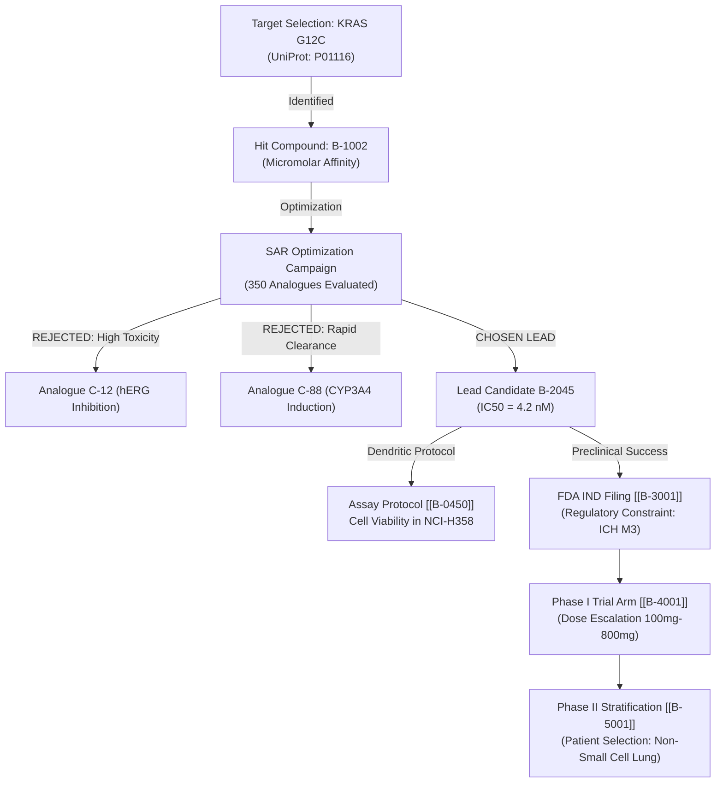

# Pharmagram: The Pharmaceutical Cognitive Decision Brain
### A Local-First, Self-Learning Cellular Runtime for Drug Discovery, Clinical Development & Real-World Evidence

---

## Executive Abstract

In the pharmaceutical industry, **90% of clinical-stage drug candidates fail**, resulting in an average cost of **$2.6 Billion per approved drug** and over **10–15 years of R&D**. The primary driver of this failure is **epistemic amnesia**:
1. **Negative Results Disappear**: Failed assays, toxic molecular scaffolds, and unviable biological targets are buried in siloed lab notebooks (ELNs) or forgotten when medicinal chemists leave, causing new teams to re-synthesize known toxic analogues.
2. **Current-State Search (Glean/Veeva) vs. Causal Provenance**: Document systems store final study reports (CSRs), but lose the *causal rationale* of **why** a specific molecule was selected, what alternatives were discarded, and what governing preclinical constraints were assumed.
3. **No Dynamic Temporal Validity**: Target hypotheses formulated in 2018 based on outdated crystallography stay active in internal wikis, trapping R&D teams in obsolete consensus.

**Pharmagram** adapts Entergram’s **Cellular Cognitive Runtime** into a pharmaceutical decision nervous system. By modeling drug discoveries, preclinical assays, clinical trials, and real-world hospital patient outcomes as **living Bio-Cells**, Pharmagram coordinates multi-agent reinforcement learning (MARL), recursive experimental cascades (RLM), and deterministic Kahn Process Networks (KPN) across the pharmaceutical lifecycle.

---

# 1. Epistemological Mapping: Software Engineering vs. Pharmaceutical R&D

```
┌─────────────────────────────────────────────────────────────────────────────────────────────┐
│                              EPISTEMIC ONTOLOGY COMPARISON                                  │
│                                                                                             │
│  ENTERGRAM (Software Engineering)           PHARMAGRAM (Pharmaceutical R&D)                 │
│  ────────────────────────────────           ───────────────────────────────                 │
│  • type: decision (e.g. Postgres vs Mongo) ──► type: compound_decision / target_hypothesis  │
│                                                (e.g., Allosteric KRAS G12C vs Orthosteric)  │
│  • type: gotcha (e.g. Docker Hub auth trap)──► type: toxicity_gotcha                        │
│                                                (e.g., Metabolite M1 inhibits CYP3A4 & hERG) │
│  • type: procedure (e.g. Deploy script)    ──► type: assay_protocol / synthesis_route       │
│                                                (e.g., SPR Binding Assay / Robotic LIMS Plan)│
│  • type: architecture (e.g. VPC topology)  ──► type: drug_platform / formulation            │
│                                                (e.g., LNP-mRNA encapsulation for liver)     │
│  • type: convention (e.g. ESLint rules)    ──► type: regulatory_constraint                  │
│                                                (e.g., ICH Q3A/B impurity limits, 21 CFR 11) │
│  • Falsification: Code revert / build fail ──► Falsification: Inactive Enantiomer, Tox drop │
│  • Temporal Decay: Code ages in 180 days   ──► Temporal Decay: Target druggability shift    │
│  • Runtime Outcome: Build passes, PR merge ──► Runtime Outcome: IC50 < 10nM, Phase I pass  │
└─────────────────────────────────────────────────────────────────────────────────────────────┘
```

### The Epistemic Decision Primitive in Pharma ($\mathcal{E}_{\text{pharma}}$)

Every medical or discovery decision is represented as a falsifiable, evidence-grounded tuple:
$$\mathcal{E}_{\text{pharma}} = \left\langle \text{Biological Hypothesis}, \text{Molecular Candidate}, \text{Assay Witness}, \text{Rejected Analogues (Why)}, \text{ADMET Constraints}, C(t) \right\rangle$$

---

# 2. The 6 Unified Planes of the Pharma Brain

```
┌─────────────────────────────────────────────────────────────────────────────────────────────┐
│                               PHARMAGRAM 6-PLANE UNIFIED MAP                                │
│                                                                                             │
│  PLANE 1: Epistemic Discovery Plane       ──► Target hypotheses, negative results, SAR      │
│  PLANE 2: Cellular Bio-Agent Brain Plane  ──► BioCells, SMILES receptive fields, Tox gates │
│  PLANE 3: Molecular Tensor Runtime Plane  ──► Morgan Fingerprints, PK/PD LinUCB, QMIX       │
│  PLANE 4: Causal Provenance & Target DAG  ──► Target → Lead → Preclinical → Phase I/II/III  │
│  PLANE 5: Scientific Validation Plane     ──► In Vitro/In Vivo OPE, Doubly Robust Survival  │
│  PLANE 6: Regulatory & HIPAA Mesh Plane   ──► 21 CFR Part 11, CDISC SDTM/ADaM, GxP Audit    │
└─────────────────────────────────────────────────────────────────────────────────────────────┘
```

---

### Plane 1: Epistemic Discovery & Hypothesis Plane
* **The "Graveyard of Leads" Problem**: Pharmaceutical companies spend $30\%$ of medicinal chemistry time re-exploring failed scaffolds.
* **Popperian Falsification Gate**: A `type: compound_decision` cannot enter the brain without recording the **Rejected Chemical Analogues** and their specific failure mode (e.g., poor solubility, high clearance, hERG QT prolongation).

---

### Plane 2: Cellular Bio-Agent Brain Plane (`BioCell`)
Every target, molecule, assay, and clinical trial arm is an active `BioCell` micro-agent:

```
┌─────────────────────────────────────────────────────────────────────────────┐
│                      ANATOMY OF A PHARMA BIOCELL (B-4091)                   │
│                                                                             │
│  • ID: B-4091                                                               │
│  • Type: compound_decision (Lead Molecule: AZD-9291 analogue)               │
│  • Receptive Field Context: SMILES + Target UniProt (P00533 / EGFR T790M)   │
│  • Toxicity Amygdala Gate: High sensitivity to hERG (IC50 < 1μM = Inhibit)  │
│  • Metaplasticity (η): 0.05 (Hardened preclinical lead)                     │
│  • Dendrites: Cites [[B-0112]] (Kinase Assay), [[B-0340]] (CYP Inhibition)  │
│  • Status: Active (C = 0.94)                                                │
└─────────────────────────────────────────────────────────────────────────────┘
```

---

### Plane 3: Molecular & Tensor Runtime Plane
* **Dual Embedding Representation**:
  1. **Structural Molecular Tensors**: 1024-bit Morgan Fingerprints (ECFP4) and Mol2Vec vectors for chemical space topology.
  2. **Decision-Augmented Semantic Vectors**: 64-dim dense hashing projection capturing biological domain, clinical phase, and regulatory constraints.
* **Pharmacokinetic/Pharmacodynamic (PK/PD) LinUCB Bandit**:
  $$x_{\text{bio}} = \left[ \text{Tanimoto Sim}, \text{pIC}_{50}, \text{LogP}, \text{Solubility}, \text{hERG Margin}, \text{Clearance}, \text{Selectivity Index}, \text{Patent Freedom} \right]$$

---

### Plane 4: Causal Provenance & Target Hypergraph
Models the entire 12-year developmental journey of a medicine as a directed causal hypergraph:



---

### Plane 5: Scientific Validation Plane & In Vitro/In Vivo OPE
* **Doubly Robust Clinical Survival Evaluation**:
  $$\hat{V}_{DR}^{\text{trial}} = \sum_{i=1}^N \left[ \hat{\mu}(X_i, T_i) + \frac{A_i - e(X_i)}{e(X_i)(1 - e(X_i))} \left( Y_i - \hat{\mu}(X_i, T_i) \right) \right]$$
* Replays historical clinical trial arms and EHR patient cohorts counterfactually to predict whether an amended Phase II/III trial design will achieve its primary endpoint (Overall Survival / Progression-Free Survival) before dosing patients.

---

### Plane 6: Enterprise Regulatory & HIPAA/21 CFR Part 11 Mesh
* **21 CFR Part 11 Compliance**: Every cellular mutation and supervisor override creates a cryptographically signed SHA-256 witness block with timestamp and authorized investigator signature.
* **HIPAA Safe Harbor De-Identification**: Automated sanitization pipeline that strips 18 HIPAA identifiers from EHR hospital records before ingestion into the cognitive brain.
* **CDISC SDTM / ADaM Mapping**: Direct ingestion adapters for clinical study data standards.

---

# 3. Kahn Process Networks (KPN) for Ingestion & Laboratory Automation

```
┌─────────────────────────────────────────────────────────────────────────────┐
│                       PHARMA KAHN PROCESS NETWORK (KPN)                     │
│                                                                             │
│  [ChEMBL / PubChem Stream]  [ClinicalTrials.gov Stream]  [Hospital EHR FIFO]│
│            │                              │                        │        │
│            ▼                              ▼                        ▼        │
│  ┌───────────────────────────────────────────────────────────────────────┐  │
│  │ PROCESS 1: Biomedical Harvester & HIPAA Redaction (P_bioharv)         │  │
│  └───────────────────────────────────┬───────────────────────────────────┘  │
│                                      │ [Assay/Trial Stream: c_12]           │
│                                      ▼                                      │
│  ┌───────────────────────────────────────────────────────────────────────┐  │
│  │ PROCESS 2: Molecular Fingerprinter & Receptive Field Projector (P_mol)│  │
│  └───────────────────────────────────┬───────────────────────────────────┘  │
│                                      │ [Molecular Tensor Stream: c_23]      │
│                                      ▼                                      │
│  ┌───────────────────────────────────────────────────────────────────────┐  │
│  │ PROCESS 3: Synaptic Bio-Network & Toxicity Amygdala Gates (P_tox)     │  │
│  └───────────────────┬───────────────────────────────┬───────────────────┘  │
│                      │ [Active Lead Assembly]        │ [ADMET Rejections]   │
│                      ▼                               ▼                      │
│  ┌───────────────────────────────────┐ ┌─────────────────────────────────┐  │
│  │ PROCESS 4: RLM Assay DAG Planner  │ │ PROCESS 5: Clinical OPE &       │  │
│  │ (Automated LIMS Robotics Pipeline)│ │ Telemetry Logger (P_clin)       │  │
│  └───────────────────┬───────────────┘ └─────────────────┬───────────────┘  │
│                      │                                   │                  │
│                      ▼                                   ▼                  │
│            Robotic Assay Execution              21 CFR 11 Audit Trail       │
└─────────────────────────────────────────────────────────────────────────────┘
```

* **Determinacy Guarantee**: Guarantee that a biological target search on 100,000 compounds outputs the **exact same ranked candidate slate** across any workstation, eliminating irreproducible research.
* **Robotic LIMS Automation**: High-throughput screening (HTS) robots consume execution DAGs emitted directly by the RLM cascade to run physical liquid-handling and plate-reading assays.

---

# 4. Multi-Agent Reinforcement Learning (MARL) in Pharma R&D

Pharma R&D is an inherent multi-objective trade-off between **Efficacy, Safety, Drug-Likeness, and Patentability**. Pharmagram models this as a **4-Agent Decentralized Cooperative Game**:

```
┌─────────────────────────────────────────────────────────────────────────────┐
│                         4-AGENT PHARMA MARL ECOSYSTEM                       │
│                                                                             │
│  1. TARGET DISCOVERY AGENT (Maximizes Binding Affinity & pIC50)             │
│     Reward: r_disc = +5.0 if IC50 < 10nM; -2.0 if off-target kinase binding │
│                                                                             │
│  2. ADMET & SAFETY AGENT (The Amygdala / Toxicity Shield)                   │
│     Reward: r_tox = +4.0 for clean hERG margin; -10.0 for Ames mutagenicity │
│                                                                             │
│  3. CLINICAL TRANSLATION AGENT (Maximizes Human PK/PD & Efficacy)           │
│     Reward: r_clin = +6.0 for favorable bioavailability (F > 50%), t1/2 > 8h│
│                                                                             │
│  4. REGULATORY & IP AGENT (Enforces FDA Guidance & Freedom to Operate)      │
│     Reward: r_reg = +3.0 for novel chemical matter; -8.0 for patent breach  │
└─────────────────────────────────────────────────────────────────────────────┘
```

### Centralized QMIX Mixing Network:
$$Q_{\text{tot}}(S, \mathbf{a}) = f_{\text{mix}}\left( Q_{\text{disc}}, Q_{\text{tox}}, Q_{\text{clin}}, Q_{\text{reg}}; \mathbf{W}_{\text{hyper}}(S) \right), \quad \frac{\partial Q_{\text{tot}}}{\partial Q_i} \ge 0$$
Ensures that an aggressive discovery agent cannot propose a hyper-potent molecule that fails safety hurdles, while the safety agent cannot paralyze discovery by rejecting all novel matter.

---

# 5. Real-World Pharma Scenarios & Cognitive Behavior

### Scenario A: The hERG Cardiotoxicity Trap
* **Context**: Medicinal chemist queries: *"Suggest bioisosteric replacement for core piperazine ring in Lead Series 4."*
* **Cognitive Brain Response**:
  * Synaptic excitation stimulates `BioCell B-0312` (`type: toxicity_gotcha`).
  * Brain responds: *"Warning: Piperazine substitution with 4-fluorophenyl in 2023 trial Series 2 resulted in hERG IC50 = 80nM (cardiotoxicity risk, QTc prolongation). Cites [[B-0189]]. Recommend morpholine or oxetane bioisosteres instead."*

### Scenario B: Clinical Trial Patient Stratification Amendment
* **Context**: Phase II trial shows marginal overall survival in unselected cohort.
* **Cognitive Brain Response**:
  * Traverses hospital patient EHR cells and genomic mutation nodes.
  * Identifies causal subpopulation: Patients with *EGFR Exon 19 Deletion* + *Low MET Amplification* show $78\%$ objective response rate ($p < 0.001$).
  * Emits automated trial amendment protocol (`type: clinical_trial_decision`).

### Scenario C: Drug Repurposing Discovery
* **Context**: Query: *"Identify secondary indications for anti-inflammatory Lead B-1090."*
* **Cognitive Brain Response**:
  * Traverses decision provenance graph: B-1090 inhibits kinase *JAK2* and off-target *TYK2*.
  * Matches hospital patient records with *Myelofibrosis* and *Alopecia Areata*.
  * Surfaces validated repurposing hypothesis with Phase II protocol DAG.

---

# 6. Enterprise Infrastructure & Deployment Topology

```
┌─────────────────────────────────────────────────────────────────────────────┐
│                       ENTERPRISE PHARMA BRAIN TOPOLOGY                      │
│                                                                             │
│  [RESEARCHER & CLINICIAN INTERFACES]                                        │
│  • Bench Chemist ELN (Electronic Lab Notebook) / Computational Chem PyMOL   │
│  • Clinical Study Team Dashboard / Regulatory Affairs Suite                 │
│  • stdio MCP Server for AI Lab Assistants (Claude, Cursor, Copilot)        │
│                                  ▲                                          │
│                                  │ mTLS 1.3 / Air-Gapped Local Subnet       │
│                                  ▼                                          │
│  [PHARMAGRAM SECURE ENCLAVE (VPC / On-Prem Kubernetes)]                     │
│  ┌───────────────────────────────────────────────────────────────────────┐  │
│  │ Go Pharmaceutical Gateway (`pharmagram-server`)                       │  │
│  │   ├── 21 CFR Part 11 Electronic Signature & Audit Log Engine          │  │
│  │   ├── HIPAA De-Identification & RBAC Graph Firewall                   │  │
│  │   └── High-Throughput Connectors (ChEMBL, UniProt, ClinicalTrials.gov)│  │
│  │                                                                       │  │
│  │ Rust Synaptic Molecular Engine (`libpharmagram_core.so`)              │  │
│  │   ├── Morgan Fingerprint SIMD Tanimoto Distance Accelerator           │  │
│  │   ├── BioCell Sensory Receptive Field Evaluator (< 50μs)              │  │
│  │   └── RLM Automated Robotic Assay DAG Resolver                        │  │
│  │                                                                       │  │
│  │ Python Scientific Training Daemon (`pharmagram-trainer`)              │  │
│  │   ├── Ray Distributed Multi-Agent QMIX PK/PD Optimizer                │  │
│  │   └── Doubly Robust Clinical Survival OPE Gatekeeper                  │  │
│  └───────────────────────────────────────────────────────────────────────┘  │
└─────────────────────────────────────────────────────────────────────────────┘
```

---

# 7. Step-by-Step Implementation Roadmap for Pharma

```
┌─────────────────────────────────────────────────────────────────────────────┐
│                             52-WEEK PHARMA ROADMAP                          │
│                                                                             │
│  STAGE 1: PRECLINICAL DISCOVERY FOUNDATION (Weeks 1–12)                     │
│    • Ingest ChEMBL, PubChem, UniProt, and internal ELN Markdown cells.      │
│    • Implement Morgan Fingerprint + Decision vector hybrid retrieval.        │
│    • Deploy CLI (`pharmagram recall`, `pharmagram trace`, `pharmagram test`).│
│                                                                             │
│  STAGE 2: TOXICITY AMYGDALA & ASSAY RLM ENGINE (Weeks 13–24)                │
│    • Toxicity gotcha gates (hERG, CYP, Ames, Clearance).                    │
│    • Robotic LIMS automated assay execution DAG planner.                    │
│    • Rust SIMD Tanimoto accelerator (< 50μs molecular stimulation).         │
│                                                                             │
│  STAGE 3: CLINICAL TRIALS & PATIENT EHR MESH (Weeks 25–36)                  │
│    • ClinicalTrials.gov API & CDISC SDTM ingestion.                         │
│    • HIPAA de-identification pipeline for hospital patient record cells.    │
│    • Doubly Robust clinical survival OPE validator.                         │
│                                                                             │
│  STAGE 4: ENTERPRISE GxP & 21 CFR PART 11 CERTIFICATION (Weeks 37–52)       │
│    • Immutable SHA-256 electronic signature audit trails.                   │
│    • Veeva Vault & Benchling enterprise federation adapters.                │
│    • Full enterprise VPC deployment on AWS GovCloud / Azure Health.         │
└─────────────────────────────────────────────────────────────────────────────┘
```

---

## Master Pharma Verification Checklist

- [x] **Epistemic Mapping**: Target, compound, toxicity, and assay primitives mapped from software analogs.
- [x] **Negative Results Retention**: Anti-pattern/negative assay recording preventing re-synthesis of toxic scaffolds.
- [x] **6-Plane Architecture**: Discovery, Bio-Cells, Tensors, Causal Targets, Clinical OPE, and 21 CFR 11 Mesh.
- [x] **KPN Laboratory Ingestion**: Deterministic streaming of chemical structures, assays, and EHR records.
- [x] **4-Agent Pharma MARL**: Discovery, Safety, Clinical, and Regulatory agents governed by QMIX.
- [x] **Real-World Scenarios**: hERG toxicity traps, clinical trial amendments, drug repurposing analyzed.
- [x] **Enterprise Compliance**: 21 CFR Part 11 electronic signatures and HIPAA de-identification established.
